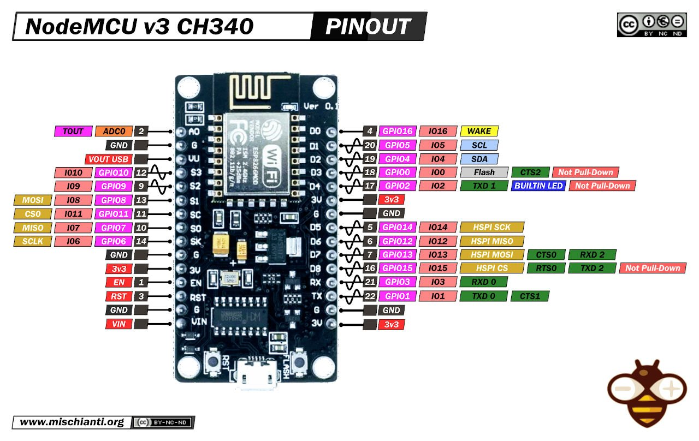

# ArduinoIO
A Arduino I/O project

# SETUP

The board and code needs to be set with serial first time and after that it should work with OTA(Over the air).

After the installation you can see the log in http://<ip>:80
or use the ws://<ip>:81 for websocket

## Hardware
### Board
Currently, we exclusively support the NodeMCU v3 board, as it is the only hardware platform we are using at this time.


### Sensors
The tempsensor is a DS18B20
### Connections

#### Tempsensor
- Red cable connected to Vin on the board
- Black cable connected to Gnd on the board
- Yellow cable is connected to D2 on the board

## Software
in "main.ino" change ssid to the netowork name, change password to the network password


`const char* ssid = "**";`

`const char* password = "**";`

## Usages
### Data
The data comes in a json format
```
{
"Type": "Temp",
"Meta": {
            "Date": "20250513 : 13:37:30"
        },
"Data": {
            "value": "19.6"
        }
}
```

### Thanks to
https://github.com/speters/ClipperDuet2N2k/
